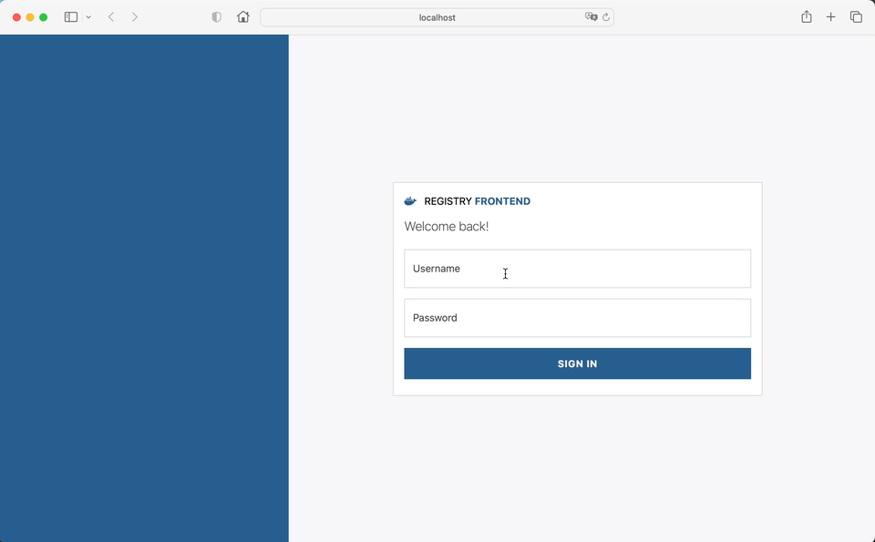

# Docker Registry Angular UI


## 🧑‍💻 About

Simple Angular- and Bootstrap-based web application for Docker Registry V2 with auth- and data cache.

## 🖥️ Preview


## 🔬 Basic Concept
- Web application determines auth provider by www-authenticate header of given registry host (can be basic auth, token auth or empty)
- Credentials are base64 encoded and encrypted by app secret using cryptoJS
- Access tokens are being cached for their valid period (expiration minus 5 seconds) and renewed if necessary.
- Tags, Manifests and Repositories are being cached until page gets reloaded
- minimizes HTTP traffic as much as possible

- See also [keycloak-docker-group-role-mapper](https://github.com/alexanderwolz/keycloak-docker-group-role-mapper) for authentication mapping.

## 🛠️ Build
### Using prebuild image from Docker Hub
- Download image: ```docker pull alexanderwolz/registry-angular-ui:latest```
### Build yourself
- ```docker build -t registry-angular-ui:latest .```

## ⚙️ Configuration
This web application supports the following environment variables:

| Variable Name                   | Description                                                                     |
|---------------------------------|---------------------------------------------------------------------------------|
|```REGISTRY_HOST```              | URL of the registry to connect to with scheme http/https                        |
|```TOKEN_SECRET```               | Secret used for encrypting the base64 credentials                               |
|```CHECK_PULL_ACCESS```          | If set to ```true```, each repository is being checked for pull permissions     |

## 🔍 Examples

- [registry-local](examples/registry-local): local registry setup
- [registry-proxy](examples/registry-proxy): using existing registry with reverse proxy (CORS)

## ✨ Credits

Thanks to [Joxit](https://github.com/Joxit/docker-registry-ui) and [Docker Hub](https://hub.docker.com) for the inspiration.


- - -

Made with ❤️ in Bavaria
<br>
© 2023, <a href="https://www.alexanderwolz.de"> Alexander Wolz
